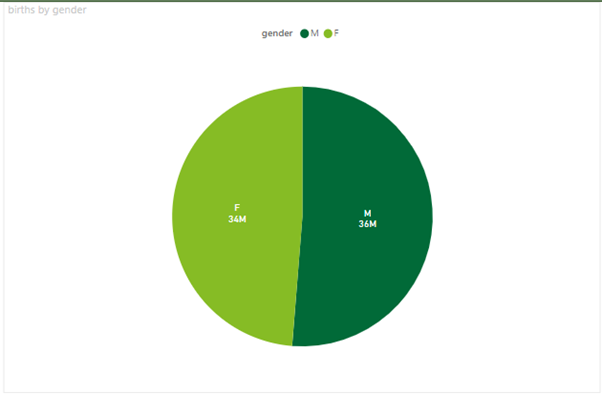
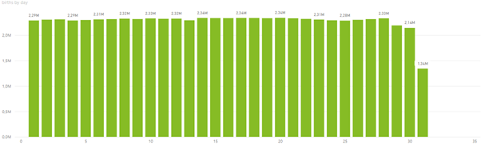
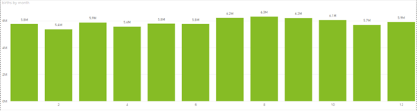
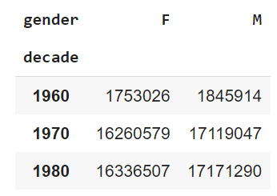
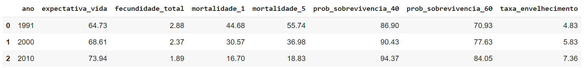
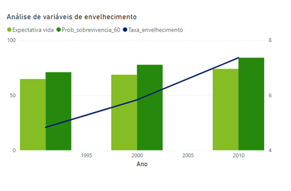
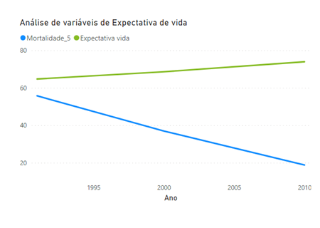
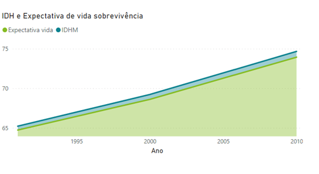

## SQUAD 8 
Alice Ferreira Alves

Daniele Cristina Chan

Gabriela Moreno Bitu

Mariana Moreira Zico Roberto

#
# Análise do banco de dados, arquivo - births.csv 

Esta base de análise se trata das quantidades de nascimento nos Estados Unidos.

- Importando biblioteca Pandas

```python
import pandas as pd
```
- Importando tabela births.csv

```python
births = pd.read_csv('births.csv')
display(births)
```
- Alterando o campo data de texto para número

```python
births['day'].fillna(0, inplace = True)
births['day'] = births['day'].astype(int)
display(births)
```

- Limpando a base births.csv, removendo as datas inexistentes como 99, null' e 0

```python
births_dt_ajustada = pd.DataFrame(births)

indexDay = births_dt_ajustada[births_dt_ajustada['day'] == 99 ].index
indexDay2 = births_dt_ajustada[births_dt_ajustada['day'] == 'null' ].index
indexDay3 = births_dt_ajustada[births_dt_ajustada['day'] == 0 ].index

births_dt_ajustada.drop(indexDay, inplace = True)
births_dt_ajustada.drop(indexDay2, inplace = True)
births_dt_ajustada.drop(indexDay3, inplace = True)

print(births_dt_ajustada)
```
- Limpar as linhas que tiver mês fevereiro e data maior que 29

```python
births_dt_ajustada = births_dt_ajustada[~((births_dt_ajustada.month == 2) & (births_dt_ajustada.day > 29))]
print (births_dt_ajustada)
```
- Backup da base original com somente a limpeza de data 

```python
births_ajustada_por_dia = births_dt_ajustada
```
- Exportando tabela como .CSV para carregamento no POWER BI

```python
births_ajustada_por_dia = births_dt_ajustada
births_ajustada_por_dia_csv = pd.DataFrame(births_ajustada_por_dia)
births_ajustada_por_dia_csv.to_csv('births_ajustada_por_dia_csv.csv', header = True)
print(births_ajustada_por_dia_csv)
```
- Gráfico plotado no POWER BI do arquivo births_ajustado_por_dia_csv.csv, demonstrando a análise por dia:

**Gráfico 1**




Conforme demonstrado anteriormente, por meio dos script's do python, foi realizado as seguintes limpezas na base de análise:

1) Exclusão das informações com as datas informadas "99", "NULL" e "0";
2) Exclusão das informações que constavam data maior que 29 e mês de fevereiro.

Observou-se que com a limpeza, os anos de 1990 a 2008 foram excluídos por apresentarem datas distorcidas.

Após a limpeza da base, elaborou-se os gráficos o qual resultou nas seguintes conclusões:

Comparando os gêneros "F" feminino e "M" masculino, observou-se que a maior quantidade de nascimentos nos Estados Unidos é do gênero "M" masculino, com 2MM a mais de nascimentos, tendo como referência o período dos anos de 1969 até 1988.

Adicionalmente, observou-se que na década de 1960 a quantidade de nascimento foi menor quando comparado às demais décadas da base de análise.

**Gráfico 2**



**Gráfico 3**



Considerando apenas os meses dos anos de 1969 até 1988, observou-se que o dia que houve mais nascimentos durante esse período foi dia 20 - totalizando aproximadamente 2.3 MM, e o mês com a menor quantidade de nascimentos foi fevereiro.

- Criando coluna de década

```python
births_dt_ajustada['decade'] = 10 * (births_dt_ajustada['year'] // 10)
births_dt_ajustada.pivot_table('births', index = 'decade', columns = 'gender', aggfunc = 'sum')
print(births_dt_ajustada.head())
display(births_dt_ajustada)
```
- Importando biblioteca matplotlib e seaborn para sumarizar as quantidades de nascimentos por sexo em cada década

```python
import matplotlib.pyplot as plt
import seaborn as sns

sns.set()

birth_decade = births_dt_ajustada.pivot_table('births', index = 'decade', columns = 'gender', aggfunc = 'sum')
display (birth_decade)
```
**Tabela 1**



- Exportando tabela como .CSV para carregamento no POWER BI

```python
births_decade_csv = pd.DataFrame(birth_decade)
births_decade_csv.to_csv('births_decade.csv', header = True)
print(births_decade_csv)
```

- Gráfico plotado no POWER BI do arquivo births_decade_csv.csv, demonstrando a análise por década:

**Gráfico 4**


Durante a análise dos gráficos, observou-se que na década de 1960 houve menor quantidade de nascimentos comparados às décadas posteriores.

Adicionalmente, verificou-se que o gênero com maior nascimento é o Masculino "M".

- Sumarizando as quantidades de nascimentos por sexo em cada ano.

```python 
sns.set()

birth_year = births_dt_ajustada.pivot_table('births', index = 'year', columns = 'gender', aggfunc = 'sum')
display (birth_year)
```
- Exportando tabela como .CSV para carregamento no POWER BI

```python
births_year_csv = pd.DataFrame(birth_year)
births_year_csv.to_csv('births_year.csv', header = True)
print(births_year_csv)
```
- Gráfico plotado no POWER BI do arquivo births_year_csv.csv, demonstrando a análise por ano:

**Gráfico 5**


No ano de 1988 foi identificado a maior quantidade de nascimentos de ambos gêneros, quando comparado com os anos de 1969 até 1988.


#
# Análise do banco de dados, arquivo - brasil.csv

- Importando tabela brasil.cvs

```python
brasil = pd.read_csv('brasil.csv')
display(brasil)
```

- Selecionando colunas a serem consideradas nas análises

```python
brasil_ajustado = brasil[["ano","expectativa_vida","fecundidade_total","mortalidade_1","mortalidade_5","prob_sobrevivencia_40","prob_sobrevivencia_60","taxa_envelhecimento","idhm"]]
display(brasil_ajustado)
```
**Tabela 2**



- Exportando tabela como .CSV para carregamento no POWER BI

```python
brasil_ajustado_csv = pd.DataFrame(brasil_ajustado)
brasil_ajustado_csv.to_csv('brasil_ajustado_csv.csv', header = True)
print(brasil_ajustado_csv)
```
- Gráfico plotado no POWER BI do arquivo brasil_ajustado_csv.csv e conclusões:

**Gráfico 6**



No gráfico de Análise de variáveis de envelhecimento é possível observar que a expectativa de vida e a probabilidade de sobrevivência aos 60 anos aumentaram ao longo das décadas de forma proporcional. Para a taxa de envelhecimento, observou-se um crescimento praticamente linear de 15%  em 30 anos.

Acompanhando a análise de envelhecimento, pode-se observar no gráfico de Análise de variáveis de Expectativa de vida, que a taxa de mortalidade aos 5 anos decresceu de modo praticamente linear ao longo das décadas, em contrapartida ao aumento da expectativa de vida.

**Gráfico 7**



A seguir demonstramos mais 2 gráficos os quais complementam o crescimento da expectativa de vida ao longo das décadas:

**Gráfico 8**



**Gráfico 9**


Nestes gráficos pode-se observar o aumento da expectativa de vida acompanhada do IDH. Em contrapartida, o índice de fecundidade decresceu ao longo das décadas.
 

Com base nisto, concluímos que ao longo das décadas houve o aumento da expectativa de vida, acompanhada da probabilidade de sobrevivência e IDH. Pressume-se que essas tendências acompanham a evolução da tecnologia e desenvolvimento do país.

